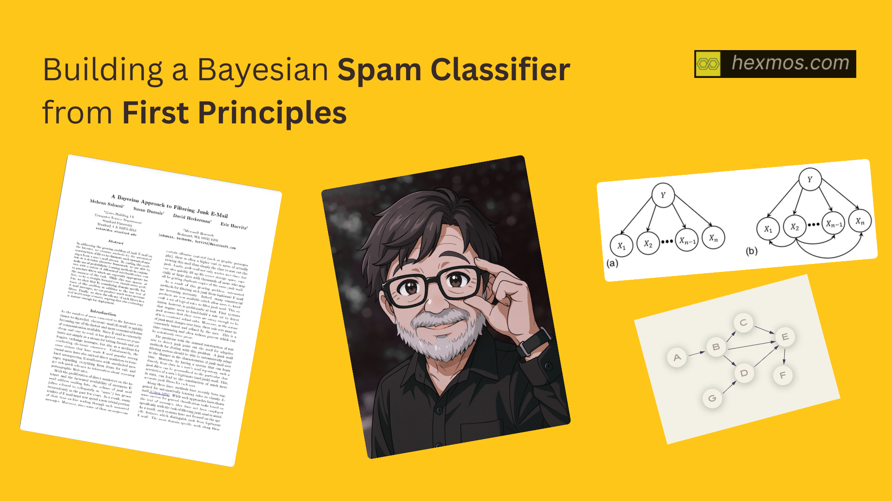

# Building a Bayesian Spam Classifier from First Principles

In 1998, Microsoft Research published a groundbreaking paper that changed how we fight spam forever. Instead of rigid manual rules, they turned to Judea Pearl’s Bayesian Networks—a framework that deals with causality and probability chains.

In this deep dive, I walk through the complete journey: from understanding Bayesian Networks and Conditional Probability Tables, to implementing both a toy classifier and a production-ready version on the Enron spam dataset. We achieve 98% accuracy using nothing but probability theory and Python.

You’ll learn:

- How Bayesian Networks represent causal relationships

- Why Naive Bayes works despite its “naive” assumptions

- The math behind spam classification (with worked examples)

- How to handle real-world messiness with sparse matrices and Laplace smoothing

- Performance analysis with confusion matrices

Whether you’re curious about the foundations of machine learning or want to understand what’s happening under the hood of modern spam filters, this is your chance to build one from scratch.

[Access Full Article at Hexmos Journal](https://journal.hexmos.com/bayesian-spam-classifier/)
